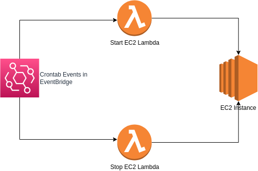

# Objetivo

Este é um projeto simples que contempla a criação de uma instância _EC2_ com configuração de __START/STOP__ automáticos através de funções _Lambda_ que serão acionadas através de eventos configurados no _EventBridge_.

A permissão padrão da instância é criada para acesso __WEB__ nas portas _80_ e _443_.

### Arquivos no projeto
O projeto conta com os seguintes arquivos:

  * main.tf
    * arquivo principal do terraform que irá buscar informações básicas na conta AWS e criar o Security Group e a instância EC2.
  * lambdas.tf
    * Código responsável pela criação das _Roles IAM_ necessárias para rodar as Lambdas; Também irá gerar arquivo compactado dos scripts python e fornecê-los como funções Lambda na AWS.
    * As Lambdas criadas possuem configuração de _X-RAY_ ativo por padrão.
  * eventbridge.tf
    * É nesse arquivo que é configurada a agenda Cron de início e parada da instância EC2. Ela não termina a instância no fim do dia, apenas dá um Stop portanto, pode manter dados persistentes na instância.
  * variables.tf
    * Arquivo de declaração de variáveis que serão usados nos outros arquivos do projeto.
  * terraform.tfvars
    * Arquivo onde inserimos os valores das varíaveis do terraform.
  * files
    * Diretório contendo as funções Python para Start/Stop da EC2 e o arquivo instala_docker.sh que é apenas um _user-data_ a ser executado quando criamos a instância.

# Purpose

This is a simple project that involves creating an EC2 instance with automatic START/STOP configuration using Lambda functions triggered by events configured in EventBridge.

The default permission for the instance is created for WEB access on ports 80 and 443.
### Files in the Project

The project includes the following files:

  * main.tf
    * The main Terraform file that will retrieve basic information from the AWS account and create the Security Group and EC2 instance.
  * lambdas.tf
    * Code responsible for creating the necessary IAM Roles to run the Lambdas; It will also generate a compressed file of the Python scripts and provide them as Lambda functions in AWS.
    * The created Lambdas have X-RAY configuration enabled by default.
  * eventbridge.tf
    * This file configures the Cron schedule for starting and stopping the EC2 instance. It does not terminate the instance at the end of the day, only stops it so it can maintain persistent data on the instance.
  * variables.tf
    * File for declaring variables that will be used in other project files.
  * terraform.tfvars
    * File where we input the values of Terraform variables.
  * files
    * Directory containing the Python functions for Start/Stop of EC2 and the instala_docker.sh file, which is just a user-data to be executed when we create the instance.

